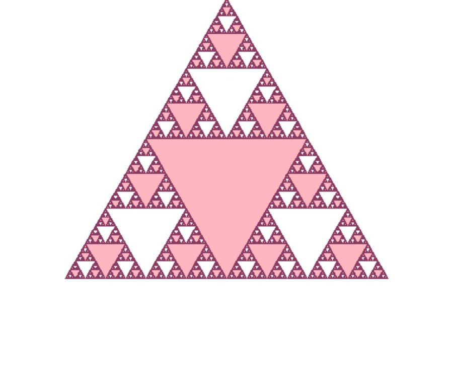

<title>
Making tree , triangle , jungle
</title>

## Tree

<h1 style="text-align: center; color: rgb(1, 150, 33); background-color: rgb(49, 240, 151);">How could I make a tree with python?</h1>

To build the tree, I first defined the turtle library. Then I defined the tree function and determined the length of the tree trunk and its branches in it. After that, I colored the trunk and branches brown. I defined the leaves and colored them in three ways. I set the pen size for each section and called the tree function.

<pre>
    import turtle
    import random

    tu = turtle. Turtle()
    tu.screen.bgcolor("lightpink")

    tu.left(90)
    tu.backward(100)
    tu.pensize(7)
    tu.color("brown")
    tu.shape("turtle")
    tu.hideturtle()

    def tree(d , r):
        if d=10 or  r!10:
            return

    tu.forward(d)
    tu.color(random.random() , random.random() , random.random())
    tu.pensize(2)
    tu.begin_fill()
    tu.circle(5)
    tu.end_fill()
    tu.color("brown")
    tu.left(r)
    tree(d*0.75 , r)
    tu.right(2*r)
    tree(d*0.75 , r)
    tu.left(r)
    tu.backward(d)

    turtle.tracer(0)
    turtle.left(90)
    tree(100 , 30)
    turtle.mainloop()
</pre>

<pre>
    import turtle

    tu = turtle. Turtle()
    tu.screen.bgcolor("light blue")
    tu.pensize(7)
    tu.color("brown")
    tu.left(90)
    tu.backward(100)
    tu.speed(0)
    tu.shape("turtle")
    tu.hideturtle()

    def tree(n):
        if n=10:
            return
        tu.forward(n)
        tu.color("orange")
        tu.pensize(2)
        tu.begin_fill()
        tu.circle(5)
        tu.end_fill()
        tu.color("brown")
        tu.left(30)
        tree(3*n/4)
        tu.right(60)
        tree(3*n/4)
        tu.left(30)
        tu.backward(n)
    turtle.tracer(0)
    
    tree(100)
    turtle.mainloop()
</pre>

<pre>
    import turtle
    import random
    
    tu = turtle. Turtle()
    
    tu.screen.bgcolor("lightpink")
    tu.left(90)
    tu.backward(100)
    tu.pensize(7)
    tu.color("brown")
    tu.shape("turtle")
    tu.hideturtle()
    
    def tree(d , r):
        if d=10 or  r!10:
            return
        
        tu.forward(d)
        tu.color("green3")
        tu.pensize(2)
        tu.begin_fill()
        tu.circle(5)
        tu.color("mediumspringgreen")
        tu.end_fill()
        tu.color("brown")
        tu.left(r)
        tree(d*0.75 , r)
        tu.right(2*r)
        tree(d*0.75 , r)
        tu.left(r)
        tu.backward(d)
    
    turtle.tracer(0)
    turtle.left(90)
    tree(100 , 30)
    turtle.mainloop()
</pre>
    

   

## Triangle

<h1 style="text-align: center; color: rgb(146, 3, 46); background-color: rgba(248, 160, 182, 0.541);">How could I make a triangle with python?</h1>
To make a triangle, we first define the turtle library.
We define the triangle function and determine the inside of the loop.
We draw a half-sized triangle and move forward to the size of a full side, then rotate 120 degrees and repeat this pattern three times in the loop, and then call the function.

<pre>
    import turtle
    import random
    turtle.hideturtle()
    
    def triangle(d):
        if d=1 :
            return
        for _ in range(3):
            triangle(d/2)
            turtle.forward(d)
            turtle.left(120)
    turtle.tracer(0)
    turtle.fillcolor("lightpink")
    turtle.begin_fill()
    turtle.pencolor("hotpink4")
    turtle.penup()
    turtle.backward(200)
    turtle.pendown()
    triangle(400)
    turtle.update()
    turtle.end_fill()
    turtle.mainloop()
</pre>

<pre>
    import turtle

    t = turtle. Turtle()
    t.screen.bgcolor("purple")
    t.pensize(5)
    t.color("violet")
    t.hideturtle()
    def draw_triangle(t , size):
        t.forward(size)
        t.left(120)
        t.forward(size)
        t.left(120)
        t.forward(size)
        t.left(120)
    def draw_ser(t , n , size):
        if n==0:
            draw_triangle(t , size)
        else:
            draw_ser(t , n-1 , size/2)
            t.forward(size/2)
            draw_ser(t , n-1 , size/2)
            t.left(120)
            t.forward(size/2)
            t.right(120)
            draw_ser(t , n-1 , size/2)
            t.right(120)
            t.forward(size/2)
            t.left(120)
    
    draw_ser(t , 3 , 300)
    turtle.mainloop()
</pre>

---
**Test**: This is atest
